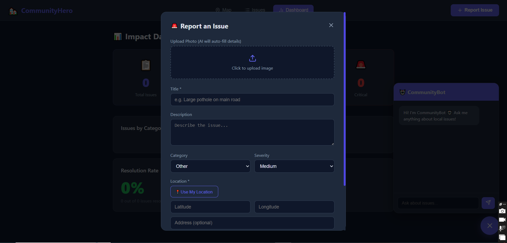
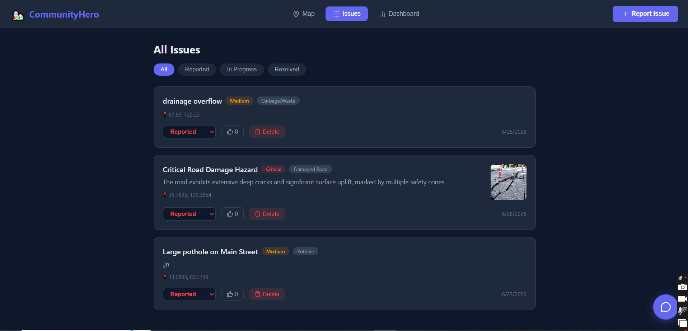
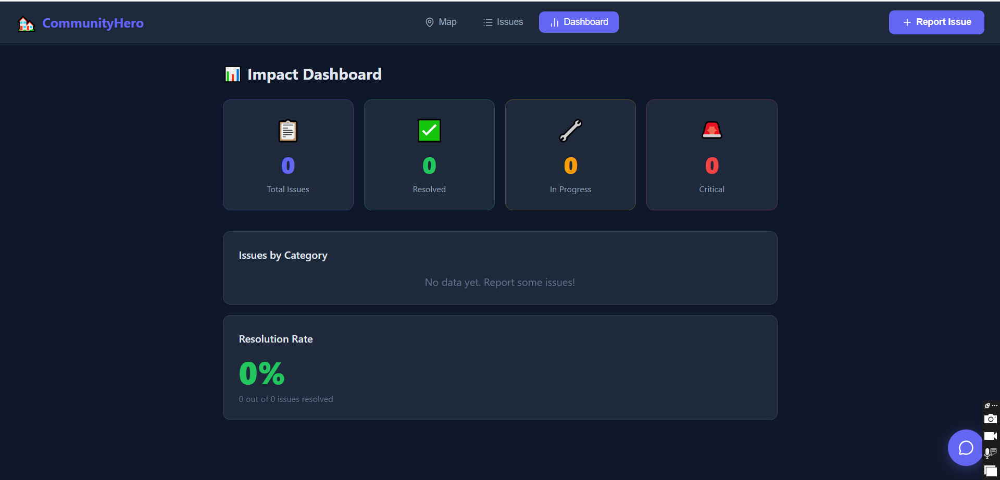
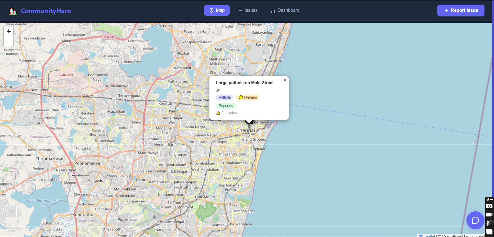
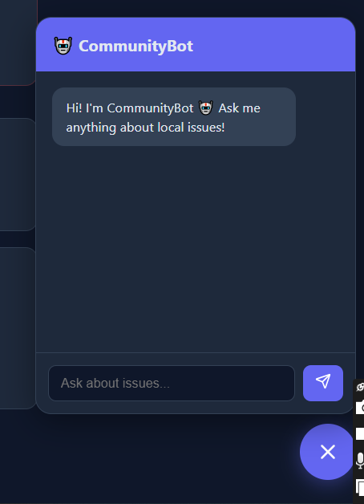

# FixIt 🔧
### AI-Powered Civic Issue Reporting Platform

FixIt enables citizens to identify, report, track, and resolve community problems like potholes, water leakages, broken streetlights, and waste management issues — powered by Google Gemini AI.

## 🌐 Live Demo
👉 https://community-hero-ten.vercel.app/

## 🛠️ Features
- 📸 **AI Image Analysis** — Upload a photo, Gemini 2.5 Flash auto-detects issue type, severity & description
- 🗺️ **Interactive Map** — All issues pinned live on OpenStreetMap via Leaflet.js
- 📋 **Issue Tracking** — Status updates: Reported → In Progress → Resolved
- 👍 **Community Upvoting** — Prioritize high-impact issues
- 📊 **Impact Dashboard** — Resolution rates, category breakdowns & stats
- 🤖 **CommunityBot** — AI chat assistant for querying local issues

## 🧱 Tech Stack
| Layer | Technology |
|-------|-----------|
| Frontend | React + Vite |
| Backend | Node.js + Express |
| Database | MongoDB Atlas |
| AI | Google Gemini 2.5 Flash |
| Maps | Leaflet.js + OpenStreetMap |
| Deployment | Vercel (frontend) + Render (backend) |

## 🚀 Getting Started

### Prerequisites
- Node.js
- MongoDB Atlas account
- Google Gemini API key

### Installation

**Clone the repo:**
```bash
git clone https://github.com/AngellinaJoycePaul/community-hero.git
cd community-hero
```

**Setup Backend:**
```bash
cd backend
npm install
cp .env.example .env
# Fill in your credentials in .env
node index.js
```

**Setup Frontend:**
```bash
cd frontend
npm install
npm run dev
```

## 🔑 Environment Variables
Create a `backend/.env` file:
```env
PORT=5000
MONGODB_URI=your_mongodb_uri
GEMINI_API_KEY=your_gemini_api_key
```

## 📸 Screenshots
Below are screenshots from the app:

<p align="center">
	
	
	
</p>

<p align="center">
	
	
</p>

## 👩‍💻 Built By
Angellina Joyce Paul — [GitHub](https://github.com/AngellinaJoycePaul)

Built for the Vibe2Ship 2026 🏆